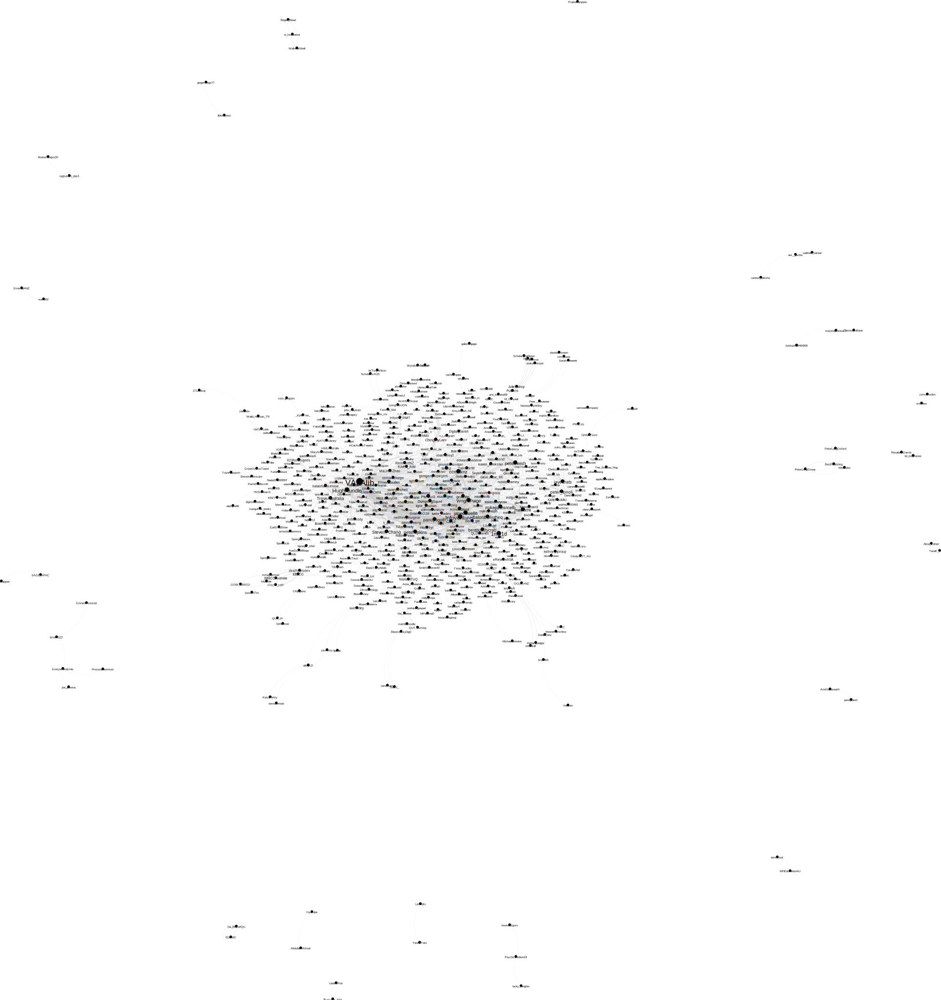

```{r setup, include=FALSE}
knitr::opts_chunk$set(echo = FALSE, message = FALSE, warning = FALSE)
library(rtweet)
library(dplyr)
library(tidyr)
library(ggplot2)
library(lubridate)
library(knitr)
library(wordcloud)
library(tidytext)
library(igraph)

theme_set(theme_light())

vala <- readRDS("data/vala.rds")
```

# Introduction
An analysis of tweets from VALA 2018. Code is available on [GitHub](https://github.com/peterneish/vala-tweets).

`r nrow(vala)`
tweets were collected using the `rtweet` R package:

```{r search-twitter, eval=FALSE, echo=TRUE}
vala <- search_tweets("#vala2018", 10000)
saveRDS(vala, "data/vala.rds")
```

## Search all the hashtags!
```{r hashtags}
vala %>% 
  filter(is_retweet == FALSE) %>% 
  unnest_tokens(tags, hashtags) %>% 
  filter(!is.na(tags)) %>% 
  count(tags) %>% 
  arrange(desc(n)) %>% 
  slice(1:20) %>% 
  ggplot(aes(reorder(tags, n), n)) + 
    geom_col(fill = "skyblue3") + 
    coord_flip() + 
    labs(x = "hashtag", y = "count",
         title = "Hashtags used during VALA 2018", 
         subtitle = "Top 20 hashtags in non-retweets")
```

# Timeline
## Tweets by day
```{r tweets-by-day}
vala %>% 
  mutate(date = as_date(created_at, tz = "Australia/Melbourne")) %>% 
  count(date) %>% 
  ggplot(aes(date, n)) + geom_col(fill = "skyblue3") +  
    labs(x = "Date", y = "Tweets", title = "#vala2018 tweets per day") + 
    theme(axis.text = element_text(size = 12),
          axis.title = element_text(size = 12))
```

## Tweets by day and time
Filtered for dates August 21-25, Melbourne time.
```{r tweets-by-day-hour}
vala %>% 
  mutate(datetime = as_datetime(created_at, tz = "Australia/Melbourne"),
         hour = hour(datetime)) %>% 
  group_by(date = as_date(datetime), hour) %>% 
  summarise(count = n()) %>% 
  filter(date >= as_date("2018-02-13"), date <= as_date("2018-02-15")) %>% 
  ggplot(aes(hour, count)) +
    geom_col(fill = "skyblue3") +
    facet_grid(strftime(date, "%b %d") ~ .) + 
    labs(x = "Hour", y = "Tweets", title = "#vala2018 tweets by time of day") + 
    theme(axis.text = element_text(size = 12),
          axis.title = element_text(size = 12))
```

# Users
## Top tweeters
```{r tweets-top-users}
vala %>% 
  count(screen_name) %>% 
  arrange(desc(n)) %>%
  slice(1:20) %>% 
  ggplot(aes(reorder(screen_name, n), n)) +
    geom_col(fill = "skyblue3") +
    coord_flip() + 
    labs(x = "Screen Name", y = "Tweets",
         title = "#vala2018 tweets by user",
         subtitle = "top 20 users") + 
    theme(axis.text = element_text(size = 12),
          axis.title = element_text(size = 12))
```

## Sources
```{r tweets-top-sources}
vala %>% 
  distinct(screen_name, source) %>%
  count(source) %>% 
  filter(n >= 5) %>% 
  ggplot(aes(reorder(source, n), n)) +
    geom_col(fill = "skyblue3") +
    coord_flip() + 
    labs(x = "Source", y = "Tweets",
         title = "#vala2018 tweets by source",
         subtitle = "distinct(screen_name, source) with >= 5 tweets") + 
    theme(axis.text = element_text(size = 12),
          axis.title = element_text(size = 12))
```

# Networks
## Replies
The "replies network", composed from users who reply directly to one another, 
coloured by page rank.

Click to view image.

```{r reply-network}
vala_replies <- vala %>% 
  filter(!is.na(in_reply_to_status_screen_name)) %>% 
  select(screen_name, in_reply_to_status_screen_name) %>% 
  graph.data.frame(directed = TRUE)

V(vala_replies)$label <- V(vala_replies)$name
V(vala_replies)$id    <- V(vala_replies)$name

write_graph(vala_replies, file = "data/vala_replies.graphml",
            format = "graphml")
```

 [](data/replies.svg)

## Mentions
The "mentions network", where users mention other users in their tweets.
Filtered for k-core >= 4 and coloured by modularity class.

Click to show image.

```{r mentions-network}
vala_mentions <- vala %>% 
  filter(!is.na(mentions_screen_name)) %>% 
  select(screen_name, mentions_screen_name) %>% 
  mutate(mentions_screen_name = strsplit(mentions_screen_name, " ")) %>% 
  unnest(mentions_screen_name) %>% 
  graph.data.frame()

V(vala_mentions)$label <- V(vala_mentions)$name
V(vala_mentions)$id    <- V(vala_mentions)$name

write_graph(vala_mentions, file = "data/vala_mentions.graphml",
            format = "graphml")
```

[](data/mentions.svg)

# Retweets
## Retweet proportion
```{r is-retweet}
vala %>% 
  count(is_retweet) %>% 
  ggplot(aes(is_retweet, n)) + geom_col(fill = "skyblue3") + 
    labs(x = "Is retweet", y = "Tweets",
         title = "#vala2018 tweets by retweet status") + 
    theme(axis.text = element_text(size = 12),
          axis.title = element_text(size = 12))
```

## Retweet count
```{r retweet-count}
vala %>% 
  ggplot(aes(retweet_count)) +
    geom_histogram(bins = max(vala$retweet_count), fill = "skyblue3") +
    labs(x = "Retweet count", y = "Tweets",
         title = "#vala2018 distribution of retweets per tweet") + 
    theme(axis.text = element_text(size = 12),
          axis.title = element_text(size = 12))
```

## Top retweets
```{r most-retweeted}
vala %>% 
  filter(is.na(retweet_status_id)) %>% 
  select(screen_name, text, retweet_count) %>% 
  arrange(desc(retweet_count)) %>% 
  distinct() %>%
  slice(1:10) %>% 
  kable(format = "html")
```

# Favourites
## Favourite proportion
```{r has-favorite}
vala %>% 
  mutate(has_favorite = ifelse(favorite_count > 0, TRUE, FALSE)) %>% 
  count(has_favorite) %>%
  ggplot(aes(has_favorite, n)) + geom_col(fill = "skyblue3") + 
    labs(x = "Has favorite", y = "Tweets",
         title = "#vala2018 tweets by favorited status") + 
    theme(axis.text = element_text(size = 12),
          axis.title = element_text(size = 12))
```

## Favourite count
```{r favorite-count}
vala %>% 
  ggplot(aes(favorite_count)) +
    geom_histogram(bins = max(vala$favorite_count), fill = "skyblue3") +
    labs(x = "Favorite count", y = "Tweets",
         title = "#vala2018 distribution of favorites per tweet") + 
    theme(axis.text = element_text(size = 12),
          axis.title = element_text(size = 12))
```

## Top favourites
```{r most-favorited}
vala %>% 
  select(screen_name, text, favorite_count) %>% 
  arrange(desc(favorite_count)) %>% 
  distinct() %>%
  slice(1:10) %>% 
  kable(format = "html")
```

# Quotes
## Quote proportion
```{r is-quote}
vala %>% 
  count(is_quote_status) %>% 
  ggplot(aes(is_quote_status, n)) +
    geom_col(fill = "skyblue3") + 
    labs(x = "Is quote", y = "Tweets",
         title = "#vala2018 tweets by quote status") + 
    theme(axis.text = element_text(size = 12),
          axis.title = element_text(size = 12))
```

## Quote count
```{r quotes-count}
vala %>% 
  filter(!is.na(quote_status_id)) %>% 
  count(quote_status_id) %>% 
  ggplot(aes(n)) + geom_histogram(bins = 10, fill = "skyblue3") +
    labs(x = "Quote count", y = "Tweets",
         title = "#vala2018 distribution of quotes per tweet") + 
    scale_x_continuous(limits = c(0, 10), breaks = seq(0, 10, 2)) + 
    theme(axis.text = element_text(size = 12),
          axis.title = element_text(size = 12))
```

## Top quotes
```{r most-quoted}
vala %>% 
  filter(!is.na(quote_status_id)) %>% 
  count(quote_status_id) %>% 
  filter(n > 1) %>% 
  arrange(desc(n)) %>% 
#  slice(1:10) %>% 
  inner_join(select(vala, screen_name, quote_status_id,
                    is_retweet, text)) %>% 
  filter(is_retweet == FALSE) %>% 
  select(screen_name, text, quote_count = n) %>%
  distinct() %>%
  slice(1:10) %>%
  kable(format = "html")
```

# Media
## Media count
```{r has-media}
vala %>% 
  mutate(has_media = !is.na(media_id)) %>% 
  count(has_media) %>% 
  ggplot(aes(has_media, n)) +
    geom_col(fill = "skyblue3") + 
    labs(x = "Has media", y = "Tweets",
         title = "#vala2018 tweets by media status") + 
    theme(axis.text = element_text(size = 12),
          axis.title = element_text(size = 12))
```

## Top media
```{r liked-media}
vala_media <- vala %>% 
  filter(!is.na(media_id)) %>% 
  arrange(desc(favorite_count)) %>%
  filter(favorite_count > 0)

vala_media %>%
  slice(1:10) %>% 
  select(screen_name, text, favorite_count) %>%
  kable(format = "html")
```

### Most liked media images


# Tweet text
The 100 words used 3 or more times.

```{r count-words}
data("stop_words")

vala %>% 
  filter(is_retweet == FALSE) %>% 
  unnest_tokens(word, text) %>% 
  select(word) %>% 
  filter(!word %in% c("vala2018", "https", "t.co", "amp"),
         !word %in% tolower(vala$screen_name), 
         !grepl("^\\d+$", word)) %>% 
  anti_join(stop_words) %>% 
  count(word) %>% 
  with(wordcloud(word, n, max.words = 100, min.freq = 3,
                 colors = brewer.pal(6, "Spectral")))
```
