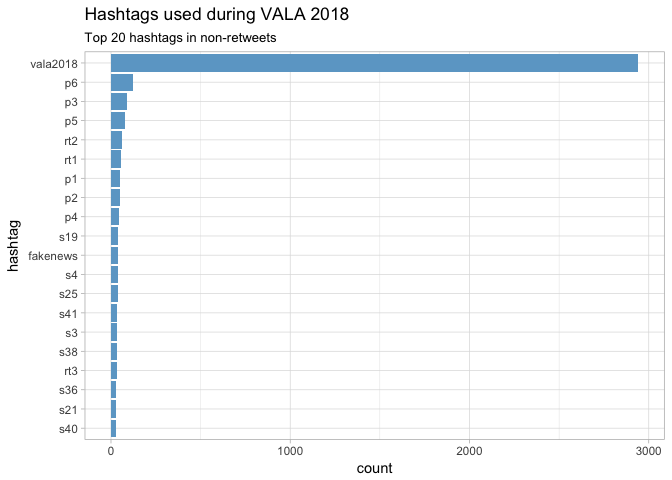
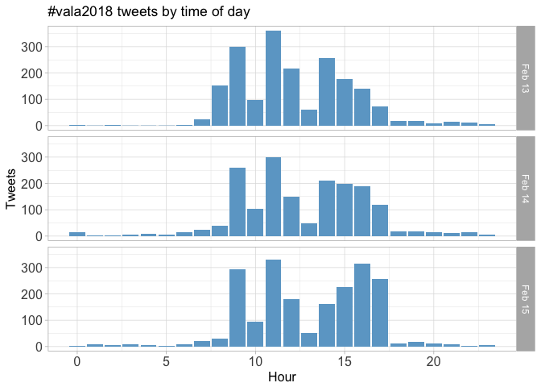
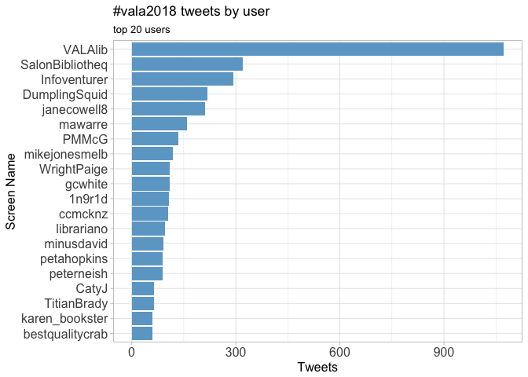
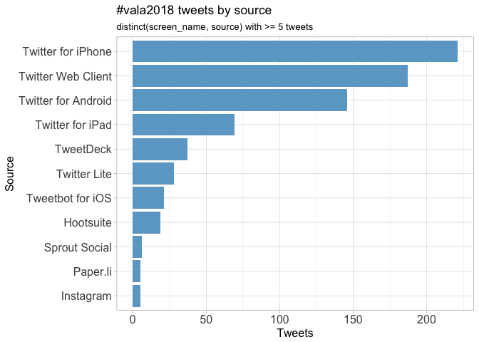
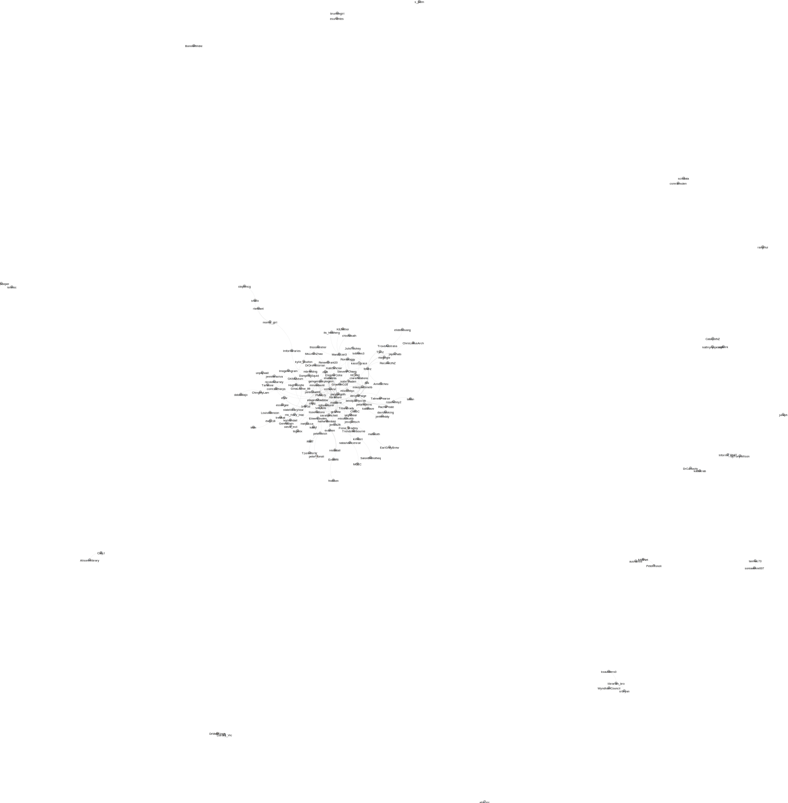
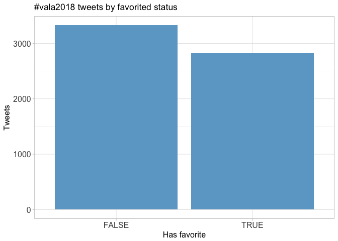
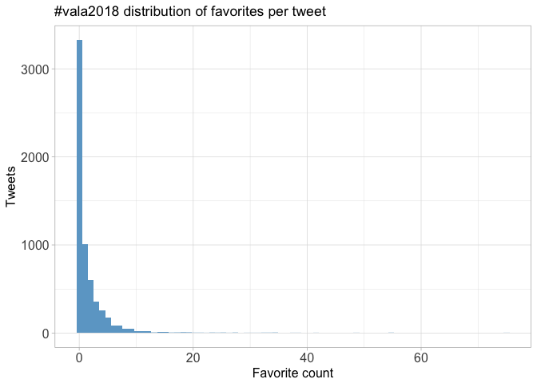
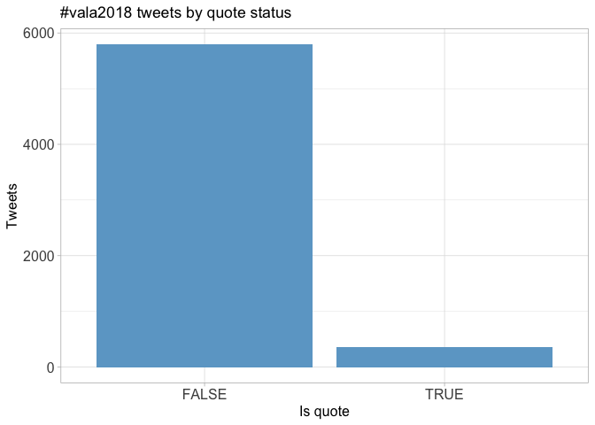
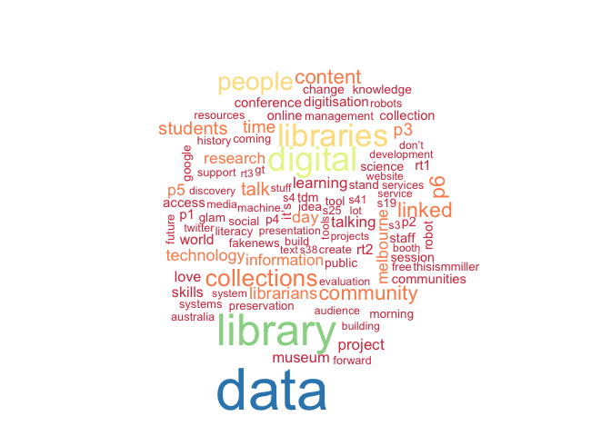

# Twitter Coverage of VALA 2018
Peter Neish  
`r Sys.time()`  


# Introduction
An analysis of tweets from VALA 2018. Code is available on [GitHub](https://github.com/peterneish/vala-tweets).

4745
tweets were collected using the `rtweet` R package:


```r
vala <- search_tweets("#vala2018", 10000)
saveRDS(vala, "data/vala.rds")
```

## Search all the hashtags!
<!-- -->

# Timeline
## Tweets by day
<!-- -->

## Tweets by day and time
Filtered for dates August 21-25, Melbourne time.
<!-- -->

# Users
## Top tweeters
<!-- -->

## Sources
<!-- -->

# Networks
## Replies
The "replies network", composed from users who reply directly to one another, 
coloured by page rank.

Click to view image.


 [](data/replies.svg)

## Mentions
The "mentions network", where users mention other users in their tweets.
Filtered for k-core >= 4 and coloured by modularity class.

Click to show image.


[](data/mentions.svg)

# Retweets
## Retweet proportion
<!-- -->

## Retweet count
<!-- -->

## Top retweets
<table>
 <thead>
  <tr>
   <th style="text-align:left;"> screen_name </th>
   <th style="text-align:left;"> text </th>
   <th style="text-align:right;"> retweet_count </th>
  </tr>
 </thead>
<tbody>
  <tr>
   <td style="text-align:left;"> HughRundle </td>
   <td style="text-align:left;"> Hey librarians you might be interested to know that @VALAlib is doing things a bit differently for #vala2018 and ev… https://t.co/Rk3cRvNq2e </td>
   <td style="text-align:right;"> 80 </td>
  </tr>
  <tr>
   <td style="text-align:left;"> peter_tonoli </td>
   <td style="text-align:left;"> “The obfuscation of digital preservation” from @jayechats #VALA2018 #S4 #DigitalPreservation #obfuscation https://t.co/iEAbE9u4eF </td>
   <td style="text-align:right;"> 34 </td>
  </tr>
  <tr>
   <td style="text-align:left;"> mawarre </td>
   <td style="text-align:left;"> The Public Domain Charter: “Digitisation of Public Domain content does not create new rights over it: works that ar… https://t.co/tOrUuR7EHU </td>
   <td style="text-align:right;"> 23 </td>
  </tr>
  <tr>
   <td style="text-align:left;"> JesselizH </td>
   <td style="text-align:left;"> Love this! #vala2018 #s10 https://t.co/dkRrPDWhDa </td>
   <td style="text-align:right;"> 17 </td>
  </tr>
  <tr>
   <td style="text-align:left;"> mikejonesmelb </td>
   <td style="text-align:left;"> When asked whether you should ask for permission or forgiveness @panoptigoth says there is a third option: carefull… https://t.co/bJCjJt73aD </td>
   <td style="text-align:right;"> 16 </td>
  </tr>
  <tr>
   <td style="text-align:left;"> StevenPChang </td>
   <td style="text-align:left;"> The idea of putting @VALAlib papers out there pre-conference has already proved an ace move - @kylie_poulton's pape… https://t.co/DURPqhlVLp </td>
   <td style="text-align:right;"> 15 </td>
  </tr>
  <tr>
   <td style="text-align:left;"> mikejonesmelb </td>
   <td style="text-align:left;"> Suggestion for the next VALA (and conferences more generally): get someone to sponsor keep cups for all delegates a… https://t.co/MAEbyUt5t5 </td>
   <td style="text-align:right;"> 14 </td>
  </tr>
  <tr>
   <td style="text-align:left;"> shalaohla </td>
   <td style="text-align:left;"> “The librarians learnt a lot too” - we don’t have to be experts to develop digital literacies in others. We can lea… https://t.co/MPiodKCOsX </td>
   <td style="text-align:right;"> 13 </td>
  </tr>
  <tr>
   <td style="text-align:left;"> Infoventurer </td>
   <td style="text-align:left;"> Do Australian academic libraries evaluate their learning projects often, in different ways and then act on it? Coup… https://t.co/R36O7CVeQv </td>
   <td style="text-align:right;"> 13 </td>
  </tr>
  <tr>
   <td style="text-align:left;"> TroveAustralia </td>
   <td style="text-align:left;"> If you’re at #vala2018 and you’re seeking a gorgeous “I &amp;lt;3 Trove” enamel badge, come to Pod 7, utter the phrase “di… https://t.co/vo0zlAhpMg </td>
   <td style="text-align:right;"> 12 </td>
  </tr>
</tbody>
</table>

# Favourites
## Favourite proportion
<!-- -->

## Favourite count
<!-- -->

## Top favourites
<table>
 <thead>
  <tr>
   <th style="text-align:left;"> screen_name </th>
   <th style="text-align:left;"> text </th>
   <th style="text-align:right;"> favorite_count </th>
  </tr>
 </thead>
<tbody>
  <tr>
   <td style="text-align:left;"> HughRundle </td>
   <td style="text-align:left;"> Hey librarians you might be interested to know that @VALAlib is doing things a bit differently for #vala2018 and ev… https://t.co/Rk3cRvNq2e </td>
   <td style="text-align:right;"> 129 </td>
  </tr>
  <tr>
   <td style="text-align:left;"> mikejonesmelb </td>
   <td style="text-align:left;"> Suggestion for the next VALA (and conferences more generally): get someone to sponsor keep cups for all delegates a… https://t.co/MAEbyUt5t5 </td>
   <td style="text-align:right;"> 72 </td>
  </tr>
  <tr>
   <td style="text-align:left;"> peter_tonoli </td>
   <td style="text-align:left;"> “The obfuscation of digital preservation” from @jayechats #VALA2018 #S4 #DigitalPreservation #obfuscation https://t.co/iEAbE9u4eF </td>
   <td style="text-align:right;"> 53 </td>
  </tr>
  <tr>
   <td style="text-align:left;"> shalaohla </td>
   <td style="text-align:left;"> “The librarians learnt a lot too” - we don’t have to be experts to develop digital literacies in others. We can lea… https://t.co/MPiodKCOsX </td>
   <td style="text-align:right;"> 42 </td>
  </tr>
  <tr>
   <td style="text-align:left;"> TroveAustralia </td>
   <td style="text-align:left;"> If you’re at #vala2018 and you’re seeking a gorgeous “I &amp;lt;3 Trove” enamel badge, come to Pod 7, utter the phrase “di… https://t.co/vo0zlAhpMg </td>
   <td style="text-align:right;"> 38 </td>
  </tr>
  <tr>
   <td style="text-align:left;"> EileenLouden </td>
   <td style="text-align:left;"> @peterneish All I can think of... #vala2018 https://t.co/sjtCNKEZF6 </td>
   <td style="text-align:right;"> 35 </td>
  </tr>
  <tr>
   <td style="text-align:left;"> rtennant </td>
   <td style="text-align:left;"> I have to say that the Tweet stream from #vala2018 is making me want to stay up beyond my bedtime at #c4l18 in Wash… https://t.co/wqvFSMElHr </td>
   <td style="text-align:right;"> 32 </td>
  </tr>
  <tr>
   <td style="text-align:left;"> ccmcknz </td>
   <td style="text-align:left;"> And the only way forward with the sheer volume is for us (librarians) to be ok with letting go of the 100% accuracy… https://t.co/6yLGcc4PzO </td>
   <td style="text-align:right;"> 32 </td>
  </tr>
  <tr>
   <td style="text-align:left;"> StevenPChang </td>
   <td style="text-align:left;"> The idea of putting @VALAlib papers out there pre-conference has already proved an ace move - @kylie_poulton's pape… https://t.co/DURPqhlVLp </td>
   <td style="text-align:right;"> 32 </td>
  </tr>
  <tr>
   <td style="text-align:left;"> fentnz </td>
   <td style="text-align:left;"> Wonderful day with these gorgeous tweeps at #Recollect pre- #VALA2018 Workshop where Australian Recollectophiles ga… https://t.co/V2DpqqNnqc </td>
   <td style="text-align:right;"> 31 </td>
  </tr>
</tbody>
</table>

# Quotes
## Quote proportion
<!-- -->

## Quote count
<!-- -->

## Top quotes
<table>
 <thead>
  <tr>
   <th style="text-align:left;"> screen_name </th>
   <th style="text-align:left;"> text </th>
   <th style="text-align:right;"> quote_count </th>
  </tr>
 </thead>
<tbody>
  <tr>
   <td style="text-align:left;"> VALAlib </td>
   <td style="text-align:left;"> Check out the whole thread: https://t.co/8vdmPShnfV #p1 #vala2018 </td>
   <td style="text-align:right;"> 14 </td>
  </tr>
  <tr>
   <td style="text-align:left;"> petahopkins </td>
   <td style="text-align:left;"> Here is the tweet mentioned #VALA2018 https://t.co/rtN8sHXQWx </td>
   <td style="text-align:right;"> 14 </td>
  </tr>
  <tr>
   <td style="text-align:left;"> ccmcknz </td>
   <td style="text-align:left;"> And the only way forward with the sheer volume is for us (librarians) to be ok with letting go of the 100% accuracy… https://t.co/6yLGcc4PzO </td>
   <td style="text-align:right;"> 11 </td>
  </tr>
  <tr>
   <td style="text-align:left;"> MARC_must_die </td>
   <td style="text-align:left;"> Great initiative this year from #VALA2018 https://t.co/DvzvUhxBaP </td>
   <td style="text-align:right;"> 9 </td>
  </tr>
  <tr>
   <td style="text-align:left;"> HughRundle </td>
   <td style="text-align:left;"> Archivists also as there's a little bit on archiving and #digipres happening at #VALA2018 https://t.co/nFRhCxiwLl </td>
   <td style="text-align:right;"> 9 </td>
  </tr>
  <tr>
   <td style="text-align:left;"> TurbittNDuck </td>
   <td style="text-align:left;"> Get reading! Thanks @VALAlib! #vala2018 #turbittnduck 🐟🦆 https://t.co/WwajNHeYq0 </td>
   <td style="text-align:right;"> 9 </td>
  </tr>
  <tr>
   <td style="text-align:left;"> aliaQLD </td>
   <td style="text-align:left;"> That's our weekend sorted! #vala2018 https://t.co/RcZs9GzwI0 </td>
   <td style="text-align:right;"> 9 </td>
  </tr>
  <tr>
   <td style="text-align:left;"> comradeharps </td>
   <td style="text-align:left;"> Including my We Need to Talk about #FakeNews paper: https://t.co/QIcNNlxMtA
#VALA2018 https://t.co/l4fkBBZKIN </td>
   <td style="text-align:right;"> 9 </td>
  </tr>
  <tr>
   <td style="text-align:left;"> wragge </td>
   <td style="text-align:left;"> #VALA2018 folks might be interested in @liblaura’s #c4l18 talk on using @glitch to encourage experimentation with l… https://t.co/iTdvjclZ8a </td>
   <td style="text-align:right;"> 7 </td>
  </tr>
  <tr>
   <td style="text-align:left;"> aliangac </td>
   <td style="text-align:left;"> Melbourne friends! Whether you're VALA-ing or not VALA-ing, this event is worth your time #VALA2018… https://t.co/x2lShmbjiL </td>
   <td style="text-align:right;"> 6 </td>
  </tr>
</tbody>
</table>

# Media
## Media count
<!-- -->

## Top media
<table>
 <thead>
  <tr>
   <th style="text-align:left;"> screen_name </th>
   <th style="text-align:left;"> text </th>
   <th style="text-align:right;"> favorite_count </th>
  </tr>
 </thead>
<tbody>
  <tr>
   <td style="text-align:left;"> peter_tonoli </td>
   <td style="text-align:left;"> “The obfuscation of digital preservation” from @jayechats #VALA2018 #S4 #DigitalPreservation #obfuscation https://t.co/iEAbE9u4eF </td>
   <td style="text-align:right;"> 53 </td>
  </tr>
  <tr>
   <td style="text-align:left;"> EileenLouden </td>
   <td style="text-align:left;"> @peterneish All I can think of... #vala2018 https://t.co/sjtCNKEZF6 </td>
   <td style="text-align:right;"> 35 </td>
  </tr>
  <tr>
   <td style="text-align:left;"> JesselizH </td>
   <td style="text-align:left;"> Love this! #vala2018 #s10 https://t.co/dkRrPDWhDa </td>
   <td style="text-align:right;"> 28 </td>
  </tr>
  <tr>
   <td style="text-align:left;"> kattekrab </td>
   <td style="text-align:left;"> Did you know that Koha libraries can catalogue the Pokémon captured in their spaces? #VALA2018 https://t.co/T2fomFmTVK </td>
   <td style="text-align:right;"> 23 </td>
  </tr>
  <tr>
   <td style="text-align:left;"> bestqualitycrab </td>
   <td style="text-align:left;"> Not actually a black and white photo! Conference #shoefie from #VALA2018 Standardization versus variation anyone? https://t.co/Wm0Kynaa6C </td>
   <td style="text-align:right;"> 23 </td>
  </tr>
  <tr>
   <td style="text-align:left;"> ccmcknz </td>
   <td style="text-align:left;"> Me, halfway through a 3 day conference #vala2018 https://t.co/hrQcpJMZ47 </td>
   <td style="text-align:right;"> 22 </td>
  </tr>
  <tr>
   <td style="text-align:left;"> roseholley2 </td>
   <td style="text-align:left;"> Feeling very honoured to receive Williamson Award #VALA2018  from Enid Williamson age 97. @UNSWCanberra @UNSWLibrary https://t.co/28yrVAI9Ym </td>
   <td style="text-align:right;"> 20 </td>
  </tr>
  <tr>
   <td style="text-align:left;"> Infoventurer </td>
   <td style="text-align:left;"> The former Department formerly known as Information Studies #vala2018 https://t.co/5LaT4Ca7L7 </td>
   <td style="text-align:right;"> 18 </td>
  </tr>
  <tr>
   <td style="text-align:left;"> mikejonesmelb </td>
   <td style="text-align:left;"> Another impressive shoe showing from @bestqualitycrab #vala2018 https://t.co/32Vb7zbaDH </td>
   <td style="text-align:right;"> 15 </td>
  </tr>
  <tr>
   <td style="text-align:left;"> txttimes3 </td>
   <td style="text-align:left;"> #librariansforrefugees speaking out #neverneutral #VALA2018 https://t.co/O3jfj4rc5R </td>
   <td style="text-align:right;"> 15 </td>
  </tr>
</tbody>
</table>

### Most liked media images


# Tweet text
The 100 words used 3 or more times.

<!-- -->
